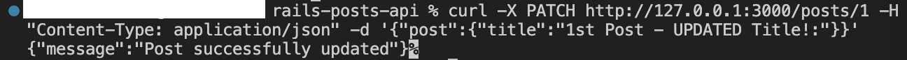

# ABOUT
* fields: title, body
* add: update endpoint
Focus on full CRUD (ALMOST!)

# STEPS

# TESTING
1. Turn on local host on a new terminal
    ``` rails s ```

2. Follow(/open on a browser) the given URL, it would look like the following
    ``` http://127.0.0.1:3000 ```

---
3. Open a new terminal and run the following to create the 1st post
    ``` curl -X POST http://127.0.0.1:3000/posts -H "Content-Type: application/json" -d '{"post":{"title":"1st Post:","body":"Lets see how the first posts looks like..."}}'  ```

    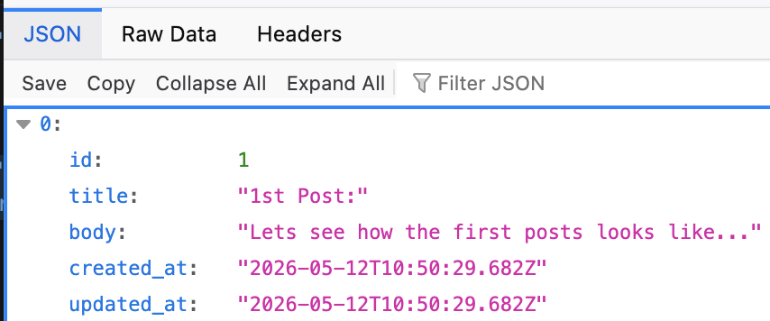

---
4. Create a 2nd post
    ``` curl -X POST http://127.0.0.1:3000/posts -H "Content-Type: application/json" -d '{"post":{"title":"2nd Post:","body":"This is the second post thats valid, so we can start experimenting"}}' ```

    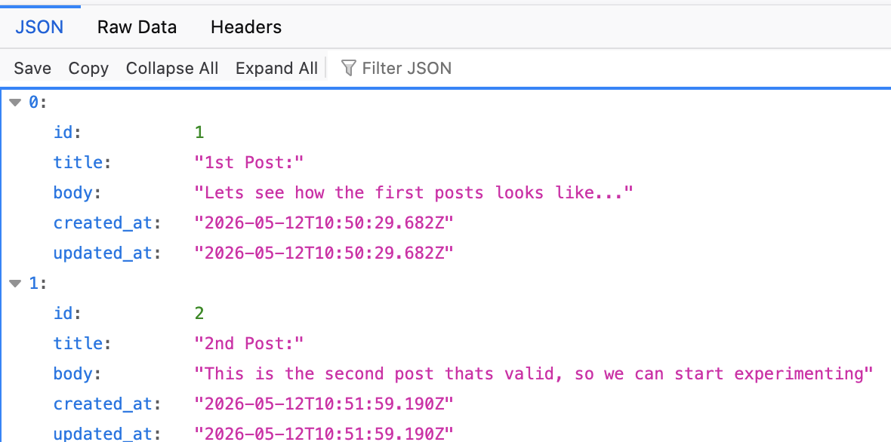

---
3. Create an invalid post, with empty title
    ``` curl -X POST http://127.0.0.1:3000/posts -H "Content-Type: application/json" -d '{"post":{"title":"","body":"Lets see how the first posts looks like..."}}' ```

    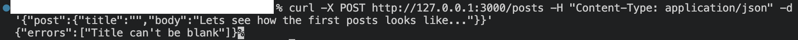

---
5. Create an invalid post, without body
    ``` curl -X POST http://127.0.0.1:3000/posts -H "Content-Type: application/json" -d '{"post":{"title":"2nd Post:"}}' ```

    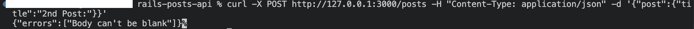

---
6. Update inexistend post
    ``` curl -X PATCH http://127.0.0.1:3000/posts/999 -H "Content-Type: application/json" -d '{"post":{"title":"1st Post - UPDATED Title!:"}}' ```

    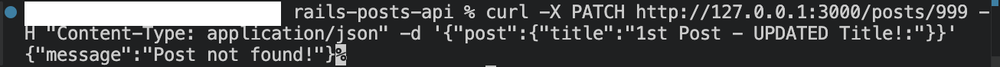

---
7.   Update the 1st post
    ``` curl -X PATCH http://127.0.0.1:3000/posts/1 -H "Content-Type: application/json" -d '{"post":{"title":"1st Post - UPDATED Title!:"}}' ```


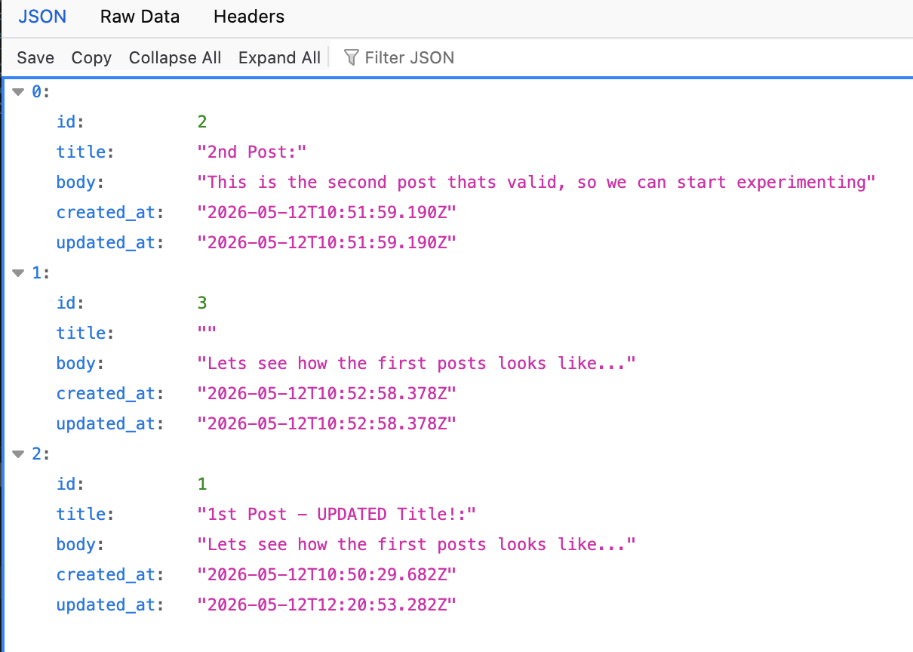

    
    NOTES: The post with empty title was created before modifying the migration file to not allow null data.

---
8. Delete an inexistent post
    ``` curl -X DELETE http://127.0.0.1:3000/posts/999 ```

    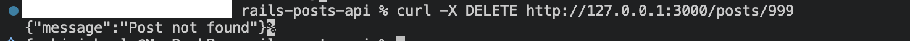

---
9. Delete the 1st post
    ``` curl -X DELETE http://127.0.0.1:3000/posts/1 ```

   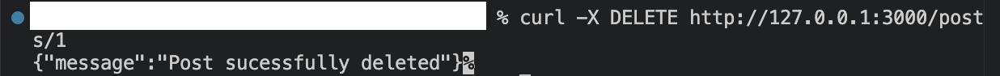

   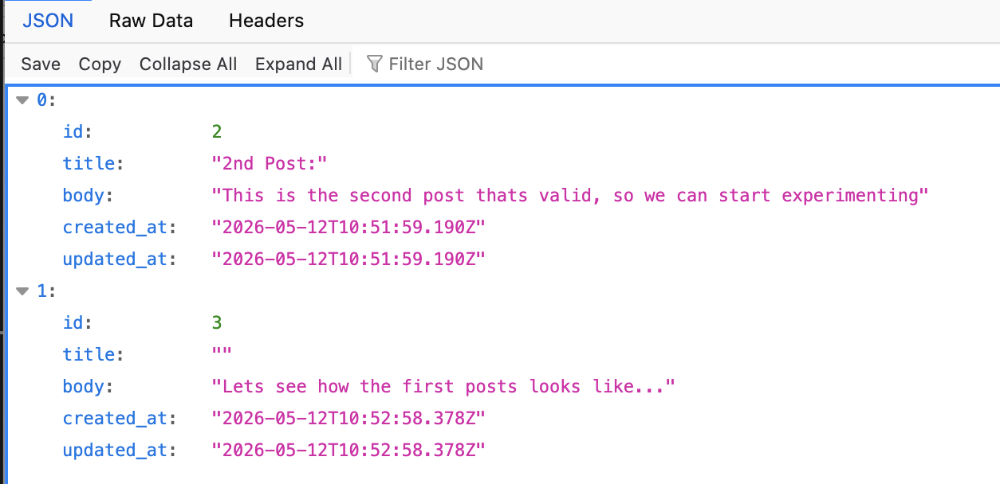

---
10. Pretty Print JSON Response (in the terminal)
    N.B: Requires jq installed.
    ``` curl http://localhost:3000/posts | jq ```

    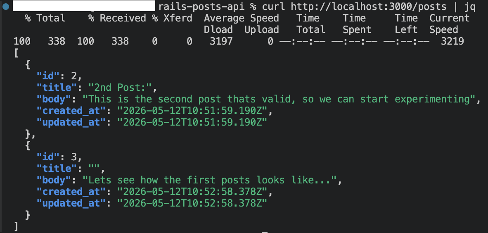
